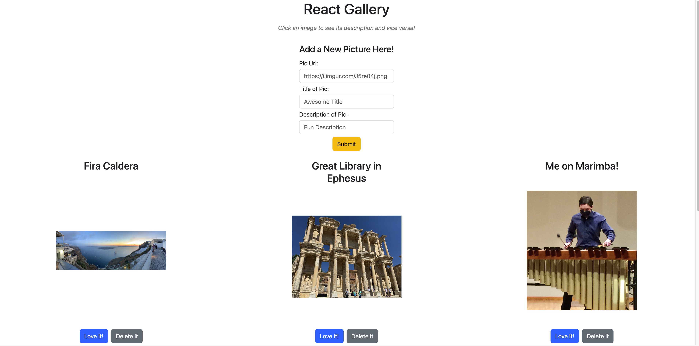
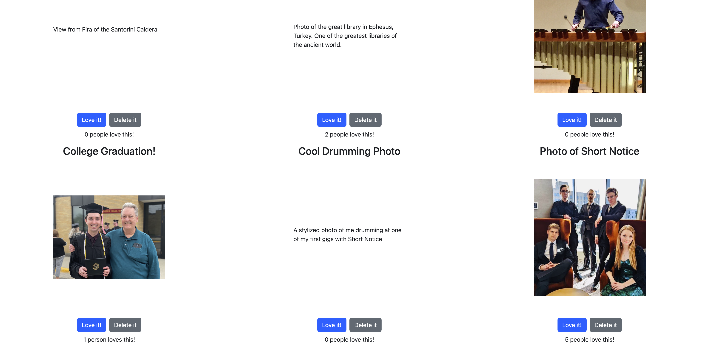

# React Gallery

## Description

_Duration: 1 Weekend_

_React Gallery_ is a CRUD app made with the React js library. The purpose of this project is to execute all four CRUD
elements (Create, Read, Update, Delete) using React's powerful tools in the context of a virtual photo gallery.

## Screen Shots

## Prerequisites

Links to sofware required to install the app:

-[Node.js](https://nodejs.org/en/)

## Installation

1. Create a database named `react-gallery`
2. The queries in the `database.sql` file are set up to create all the necessary table and populate the needed data to allow the
 application to run correctly. The project is built on [Postgres](https://www.postgresql.org/download/), so you will need to make sure to have that installed. I recommend using Postico to run those queries as that was used to create the queries
3. Open up your editor of choice and run `npm install`
4. Run `npm run server` in your terminal
5. Run `npm run client` in your terminal
6. Click the link provided by `npm run client` to open up a browser tab with the running web page on it

## Usage

- The web page displays a gallery of personal images. When an image is clicked, its display changes from the photo itself
to a description of the photo. If the description is clicked, it switches back to displaying the photo. 
- Below each photo is a "love it!" button where users can "upvote" their favorite images. This will update the upvotes in the database and
display them on the page below this button. 
- If users dislike a photo, they can press the "Delete it" button right next to the "love it" button and the photo will be removed from the gallery. (Note: this deletes the photo in the database as well as on the front end.)
- At the top of the page is a form that users can use to add new photos to the page and database. Users are required to input a picture url, title, and description before submitting to the gallery. This creates a new photo in the backend database and displays it on the front-end webpage.

## Built With

- React
- React Bootstrap

## Acknowledgement

Thanks to Emerging Digital Academy for equipping me with the support, knowledge, and skills to build this application!

## Support

If you have any issues or suggestions for improvement, please email me at [athaarsager@gmail.com]

Additional README details can be found [here](https://github.com/PrimeAcademy/readme-template/blob/master/README.md).
